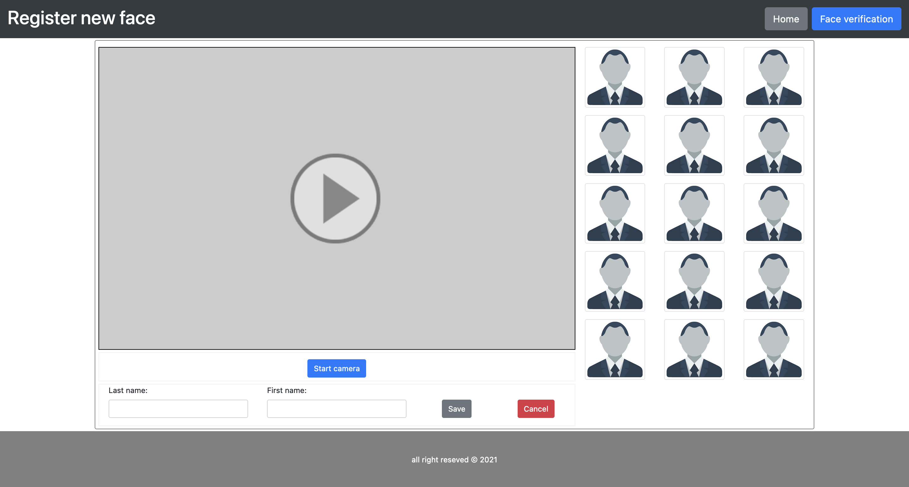

# Face Recognition Web Based

The front-end is made by simple HTML, CSS, JavaScript with the help of the JS library face-api to detect face crop it 
and send it to the API built on top of Django framework for all task related to face recognition. We suppose 15 samples per person it enough
for testing and training to get a better accuracy.

Face detector model can be found [here](https://drive.google.com/drive/folders/1RRLwH_8w8toPY8G5ARrcSGQwy459yatz?usp=sharing)
and add the face_detector folder to api/app/modelnet/ directory
## Requirements
- web server, in my case I am using apache
- python 3.7x

Note: You can choose to run both front-end and api in two separated directory, for me keep api inside the main project and
create conda environment for the api

## Installation
